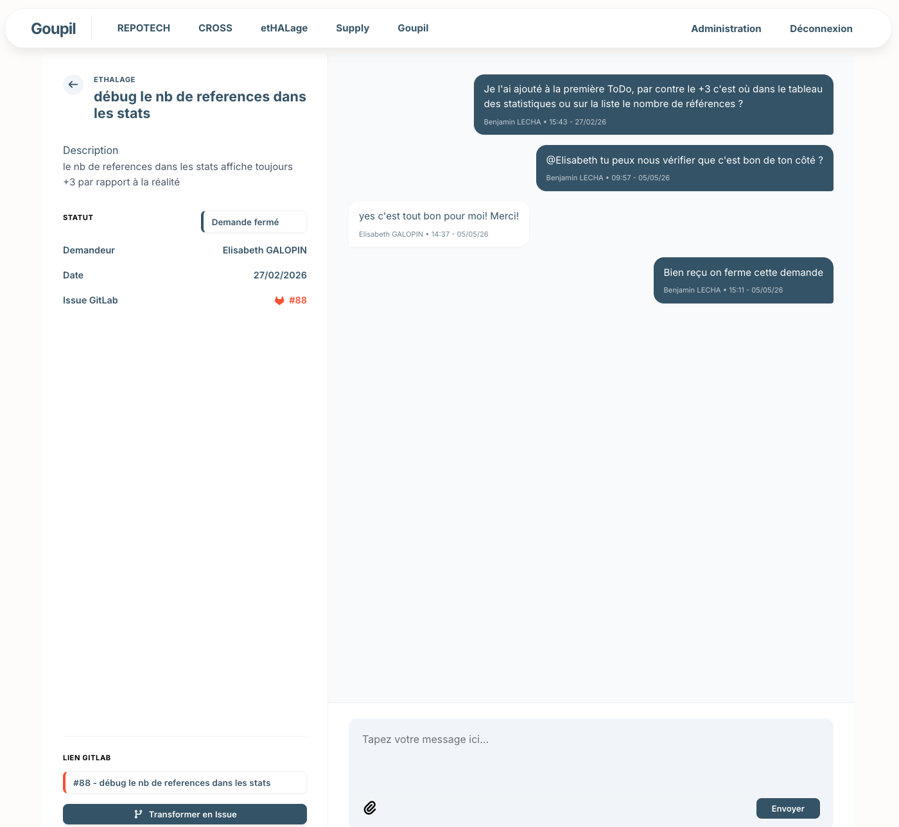

# Goupil [](https://github.com/BenjaminLECHA/Goupil/blob/main/LICENSE)

Web Interface between Users and Developper on your GitLab Project

**Goupil** is:
 * 🦊 a interface between **Users** and **Developper**;
 * ⚙️ **API** and **WebHook** linked with GitLab project;
 * 🌍 fully **web-based**;
 * ⚖️ **Open-Source** Software under the MIT License;

## What does it do?
Goupil's **main features** are:
 * a form for **user request** followed by on **online tchat**;
 * integration with **GitLab** to transform **user request** in **gitlab issues** (based on API);
 * **dasboard** with **searchbar** to display **user request** in **gitlab issues**;
 * an endpoint to updapte the dashbord when a new **gitlab issue** is add on the project (based on WebHook);
 * an **admin dashboard** to add **local user** or **gitlab project**; 

## What does it looks like?



## I just want to try it out locally !

1. `cp .env.example .env`

2. build the app 

### With podman

if you haven't done it yet, add docker hub to your postman : 

```sh
sudo echo 'unqualified-search-registries = ["docker.io"]' | sudo tee -a /etc/containers/registries.conf
```

Then, in the project folder : 

```sh
podman-compose up -d
```

### With Docker

In the project folder, just use this command : 

```sh
docker compose -f podman-compose.yml up -d --build
```

3. Log in with email `goupil@mail.com` and password `goupil`

4. Go on administration dashboard and add you App/Project (Projets), Users (Utilisateurs) and link beetween them (Attributions Projets)

> For your App, you'll need to generate an API Token on your Gitlab Project (Settings -> Access tokens -> Add new token -> api (only this scope, role at least reporter) 

## Contributing

Feel free to open issue and suggest a merge request

## F.A.Q

**Is Goupil a Ticketing tools ?**

> Kind of.

**Is working without webhook ?**

> Yes, webhook is only use to refresh quickly the issue list when an Issue is add durectly on GitLab

**Is working with GitHub ?**

> Nope, it's an open issue on this project

**Why so much code comments are in French ?**

> Oui, oui, baguette ... just didn't take the time to update these.

**What Goupil mean ?**

> This web app was designed by the [CROW plateform](https://crow.iemn.fr/) to exchange with their users.  They're looking for a name for it, continually asking their plateform to some developpement. They remember the famous french poem 'Le corbeau et le renard' de La Fontaine. Cause they're crows, them are fox but it's a too much common word in French so they took the 'old name' of this animal : Goupil
